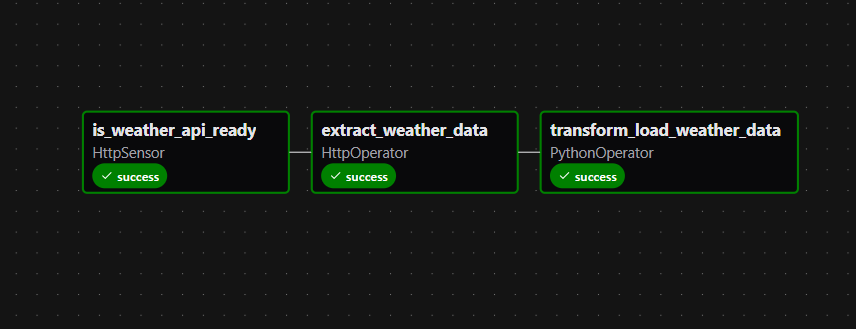

###Weather Data Pipeline with Apache Airflow, AWS S3 & EC2

### **📌 Project Overview**

This project automates the extraction, transformation, and loading of real-time weather data for Chicago. Using Apache Airflow running on an AWS EC2 instance, it fetches weather data from the OpenWeatherMap API, transforms it, and uploads the result to an S3 bucket. It is scheduled to run daily and is designed to be robust, modular, and cloud-ready.

### **🛠️ Features**

-> Automated Weather Data Collection (Chicago)

-> Data Transformation (Kelvin to Fahrenheit, UTC to local timestamps)

-> Daily Upload to AWS S3

-> Orchestration via Apache Airflow on an EC2 Instance

-> Credential-secure setup using IAM User with S3 policy

### **⚙️ Technologies Used**

-> Apache Airflow (workflow orchestration)

-> AWS EC2 (Airflow host)

-> AWS S3 (cloud data storage)

-> Python & Pandas (data processing)

-> OpenWeatherMap API (weather source)

### **DAG**

